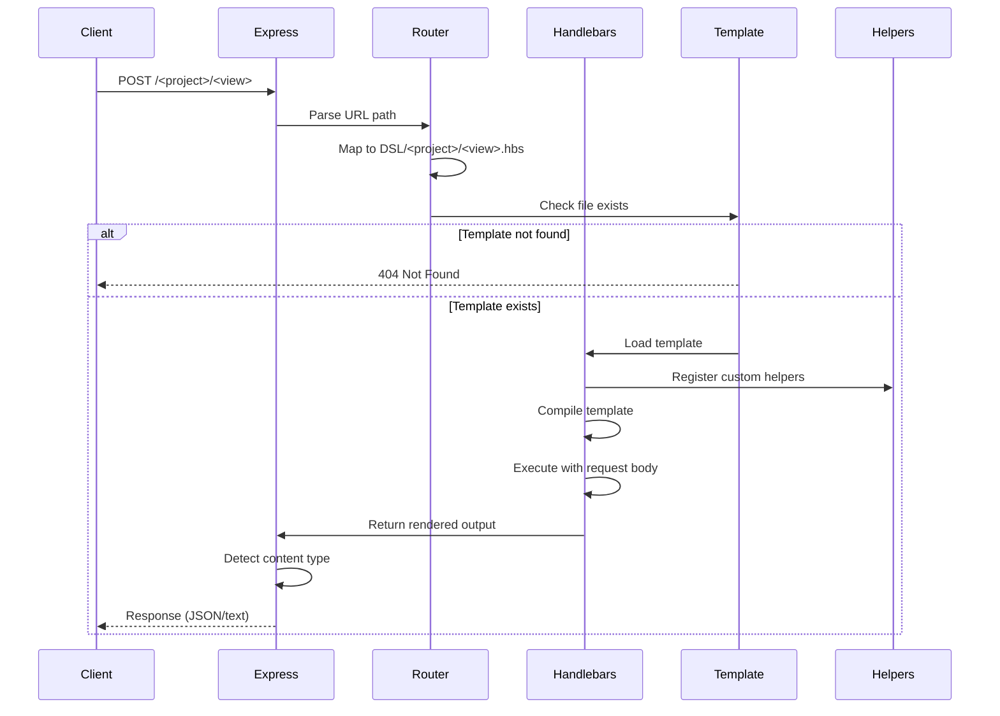
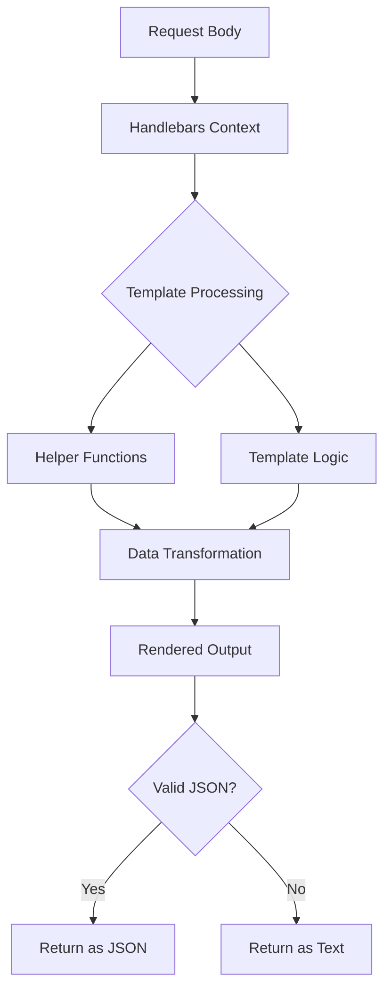
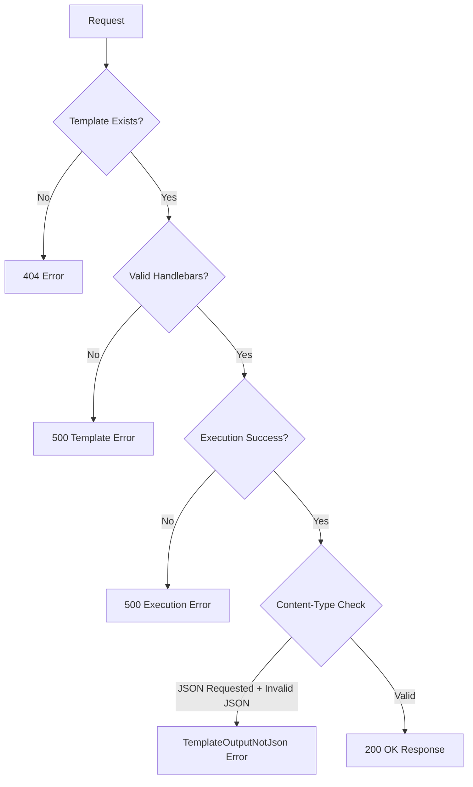
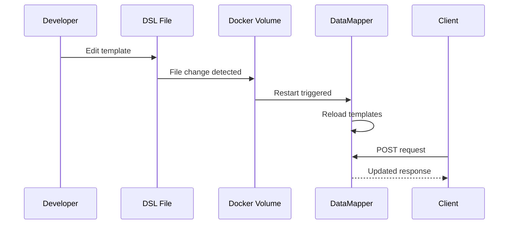
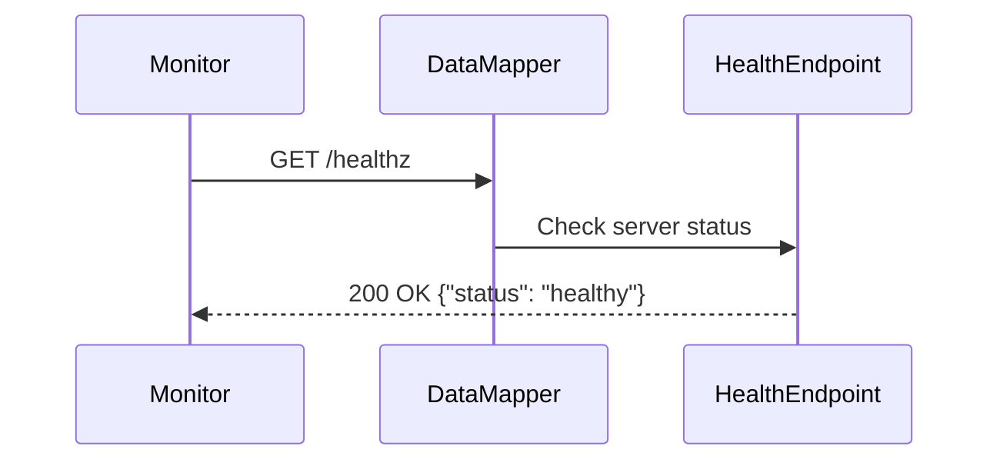

# DataMapper Data Flow

## Request Processing Flow



## Template Execution Flow



## Data Transformation Example

### Input (Client Request)
```json
{
  "userId": "123",
  "timestamp": 1234567890
}
```

### Template (DSL/samples/format.hbs)
```handlebars
{
  "user": "{{userId}}",
  "formatted_time": "{{now}}",
  "received_at": {{timestamp}}
}
```

### Output (Client Response)
```json
{
  "user": "123",
  "formatted_time": "2025-10-08T10:30:00Z",
  "received_at": 1234567890
}
```

## Error Handling Flow



## Live Reload Mechanism

When DSL templates are mounted as volumes:



## Health Check Flow



## Content Type Detection

DataMapper automatically detects response content type:

1. **Client sends `type: json` header** → Force JSON response
2. **Client sends `Accept: application/json`** → Attempt JSON parsing
3. **Template output is valid JSON** → Return as `application/json`
4. **Template output is not JSON** → Return as `text/plain`

This flexible approach allows templates to return either structured data or plain text without explicit configuration.
