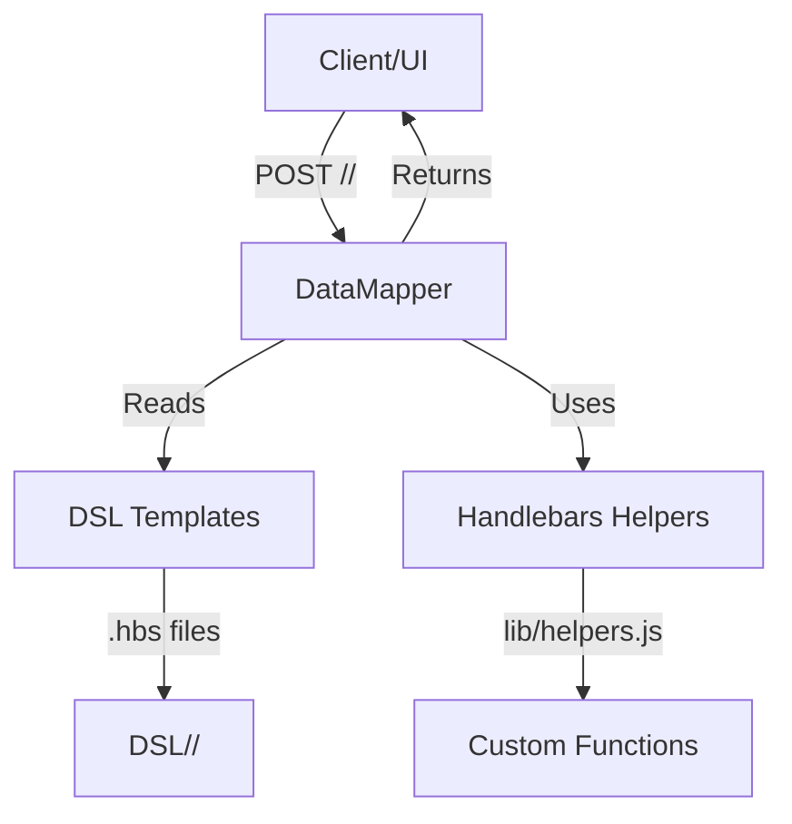
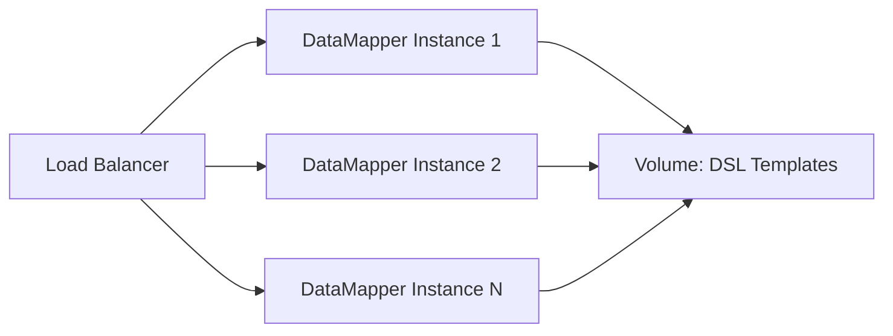

# DataMapper Architecture Overview

## Component Overview

DataMapper is a lightweight REST API server that transforms Handlebars templates into REST endpoints. It serves as a data mapping and transformation layer between backend services and frontend consumers.

## Key Components

### 1. Express Server (server.js)
- HTTP server handling POST requests
- Route mapping from URLs to template files
- Request/response processing
- Health check endpoint

### 2. DSL Templates (DSL/)
- Handlebars `.hbs` files organized by project
- Template-based data transformation logic
- Dynamic endpoint generation

### 3. Handlebars Helpers (lib/helpers.js)
- Custom functions available in templates
- Data manipulation utilities
- JSON formatting helpers

### 4. Docker Container
- Node.js runtime environment
- Volume mounting for live development
- Port 3000 exposed for HTTP

## Design Principles

### 1. Convention over Configuration
- URL structure maps directly to file paths
- `POST /<project>/<view>` → `DSL/<project>/<view>.hbs`
- No explicit route configuration needed

### 2. Template-Driven
- Business logic lives in declarative templates
- Separation of data transformation from application code
- Easy to modify without code deployment

### 3. Contract Layer
- Normalizes data formats between services
- Shields clients from backend complexity
- Single point of data transformation

### 4. Stateless
- No session management
- Each request is independent
- Horizontally scalable

## Dependencies

### Runtime
- **Node.js** - JavaScript runtime
- **Express** - Web framework
- **Handlebars** - Template engine
- **body-parser** - Request body parsing

### Development
- **Docker** - Containerization
- **Docker Compose** - Orchestration

## Deployment Architecture

## Standalone Component

DataMapper is designed as an **architecturally important**, generic component:
- No external database dependencies
- No authentication/authorization (delegated to API gateway)
- Focuses solely on data mapping and transformation
- Can be deployed independently or as part of a larger system
